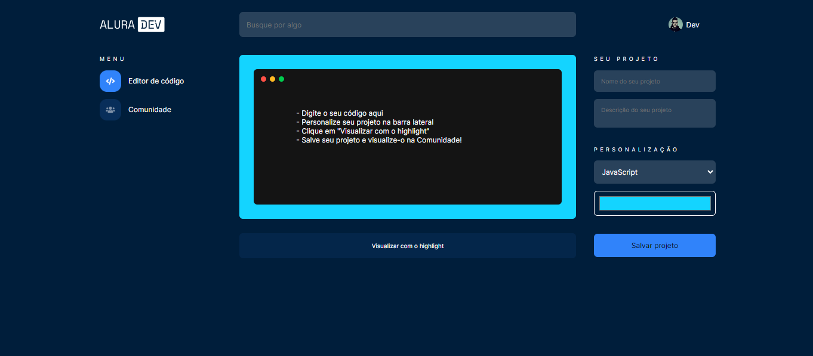

<h1 align="center">
  AluraDev
</h1>

<p align="center">
  Desafio 2 - Adicionando sintaxe Highlight com Javascript
</p>

## 📷 Deploy

<h3>Link: https://alura-desafio-2.vercel.app/</h3>
<a href="https://alura-desafio-2.vercel.app/" target="_blank">
 
</a>

### 🧭 Rodando a aplicação

```bash
# Clone este repositório
$ git clone https://github.com/HigorStos/alura_desafio-2/

# Acesse a pasta do projeto no seu terminal/cmd
$ cd alura_desafio-2

# Instale as dependências
$ npm i

# Execute a aplicação em modo de desenvolvimento
$ npm run dev
```
